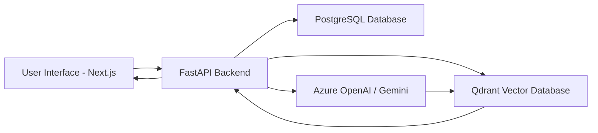

# Advanced Todo App

> A sophisticated task management application with automated recurring tasks, professional UI, and robust security.

[](https://nextjs.org/)
[](https://fastapi.tiangolo.com/)
[](https://neon.tech/)
[](https://better-auth.com/)
[](https://www.framer.com/motion/)

## 🚀 Key Features

- **Automated Recurring Tasks** - Smart task repetition with configurable patterns (daily, weekly, monthly, yearly)
- **Multi-user Isolation** - Secure data separation ensuring each user only sees their own tasks
- **Muted-Theme Professional UI** - Elegant dark-themed interface with subtle color accents for priority levels
- **Advanced Search & Filtering** - Real-time search across tasks, tags, and descriptions
- **Priority Management** - Visual distinction for high, medium, and low priority tasks
- **Responsive Design** - Seamless experience across desktop, tablet, and mobile devices

## 📁 Project Structure

```
├── frontend/                 # Next.js 16+ application with App Router
│   ├── src/
│   │   ├── app/            # Pages and layouts
│   │   ├── components/     # Reusable UI components
│   │   ├── hooks/          # Custom React hooks
│   │   ├── lib/            # Utilities and API clients
│   │   └── types/          # TypeScript type definitions
│   ├── public/
│   └── package.json
├── backend/                  # FastAPI application
│   ├── src/
│   │   ├── models/         # Database models (SQLModel)
│   │   ├── schemas/        # Pydantic schemas
│   │   ├── api/            # API routes
│   │   ├── services/       # Business logic
│   │   └── database/       # Database configuration
│   ├── tests/
│   └── requirements.txt
├── specs/                    # Feature specifications and API contracts
│   └── 001-advanced-todo-app/
│       ├── spec.md
│       ├── plan.md
│       ├── data-model.md
│       ├── contracts/
│       └── quickstart.md
└── .spec-kit/               # Spec-driven development configuration
```

## 🛠️ Tech Stack

- **Frontend**: Next.js 16, TypeScript, Tailwind CSS, Shadcn UI, Framer Motion
- **Backend**: FastAPI, Python 3.13+, SQLModel, Neon PostgreSQL
- **Authentication**: Better Auth with JWT
- **Styling**: Tailwind CSS with custom dark theme
- **Animations**: Framer Motion for smooth UI transitions
- **Architecture**: Monorepo with clear frontend/backend separation

## **Architecture Overview**

| Component | Technology | Purpose |
|-----------|------------|---------|
| **Frontend** | Next.js 16+ | User Interface and Client-side Logic |
| **Backend** | FastAPI | API Server and Business Logic |
| **Database** | PostgreSQL | Persistent Data Storage |
| **Vector DB** | Qdrant | Semantic Search and AI Integration |

## **Phase 4 Importance**

Docker containerization brings several critical advantages to this application:

- **Environment Consistency**: Ensures identical environments across development, testing, and production
- **Process Isolation**: Keeps services separated and secure from each other
- **Easy Scalability**: Simplifies horizontal scaling and deployment across different platforms
- **One-Command Setup**: Allows for quick and reliable deployment with a single command
- **Dependency Management**: Eliminates "it works on my machine" issues by packaging all dependencies

## **Prerequisites**

- **Docker Desktop** (Windows/Mac) or **Docker Engine** (Linux) - Minimum version 20.10+
- **Docker Compose** - Included with Docker Desktop
- At least 4GB of free RAM for optimal performance

## **Deployment Instructions**

To run the application using Docker Compose:

1. Navigate to the project root directory
2. Build and start all services:

```bash
docker-compose up --build
```

This command will:
- Build all necessary containers (frontend, backend, database, vector DB)
- Start services in the correct order
- Set up networking between containers
- Initialize databases
- Start the application stack

3. Access the application:
   - Frontend: http://localhost:3000
   - Backend API: http://localhost:8000
   - Qdrant Dashboard: http://localhost:6333

To stop the services, press `Ctrl+C` in the terminal or run:
```bash
docker-compose down
```

## **System Flow**



The AI interaction works as follows:
1. User interacts with the Next.js frontend
2. Requests are sent to the FastAPI backend
3. The backend processes queries and interacts with both PostgreSQL and Qdrant
4. AI (Gemini) processes natural language queries and interacts with the vector database
5. Results are returned through the containerized network to the frontend
6. The system maintains consistent data across both traditional and vector databases

## 🚀 Getting Started

For detailed installation and setup instructions, please refer to the [Quickstart Guide](./specs/001-advanced-todo-app/quickstart.md).

## 🤝 Contributing

This project follows a spec-driven development methodology. All changes should be made through the specified workflow to maintain consistency and quality.

## 📄 License

This project is licensed under the MIT License - see the LICENSE file for details.